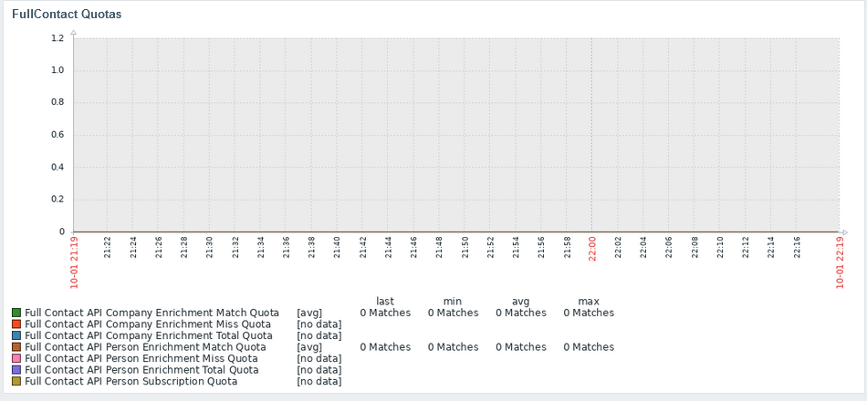
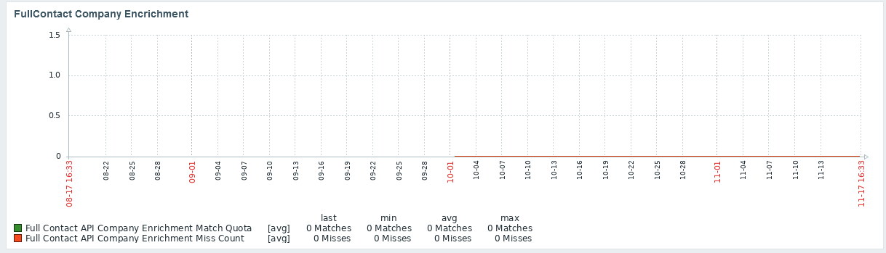
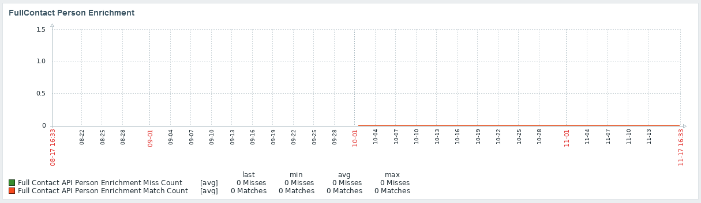
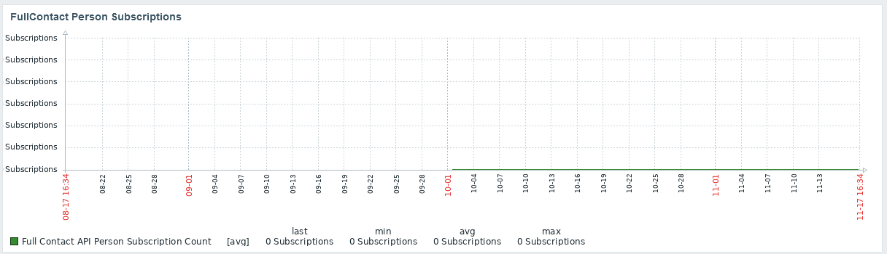

# Zabbix_FullContact_API
Zabbix Data Collector For FullContact API Provider

<!-- Start Document Outline -->

* [Background](#background)
* [Installation](#installation)
* [Methodology](#methodology)
* [Features](#features)
* [Details](#details)
* [Triggers](#triggers)
* [Macros](#macros)
* [Tags](#tags)
* [Known Limitations &amp; Issues](#known-limitations--issues)
* [Screenshots](#screenshots)
	* [Credits Graph](#credits-graph)
	* [Company Enrichment Dashboard](#company-enrichment-dashboard)
	* [Person Enrichment Dashboard](#person-enrichment-dashboard)
	* [Person Subscription Dashboard](#person-subscription-dashboard)
* [Updates](#updates)
* [Contact](#contact)
* [License](#license)
* [Thanks](#thanks)

<!-- End Document Outline -->

## Background 
This template is used to monitor and alert on FullContact Account usage.

## Installation
- Import zabbix_fullcontact_api.yaml
- Create new Host
- Assign Template "FullContact API Provider" to Host
- Set Macro {$FULLCONTACTAPIKEY} to your FullContact v3 API Key
- Add an agent host (can be left blank, only necessary to allow HTTP Agent to operate)

## Methodology
- Uses FullContact v3 API to gather Account Data via HTTP Agent items

## Features
- Quota & Plan Monitoring
- Graphs and Stuff

## Details
- 26 Items
- 25 Triggers
- 4 Graphs
- 1 Dashboard

## Triggers
- Credits Plan Change
For each of the following, Person and Company, Enrichment and Subscriptions
- Credits Overage
- Credits 50% Used
- Credits 90% Used

## Macros 
- {$FULLCONTACTAPIKEY}  (API Key for FullContact)

## Tags
- Application:API
- Application:FullContact
- API:FullContact
- FullContact:Quota (Quota)
- FullContact:Count (Count)
- FullContact:Overquota (Over Quota Use)
- FullContact:Account (Account Info)
- FullContact:Data (JSON API Data Source)
- FullContact:CompanyEnrichment (Company Enrichment Stats)
- FullContact:PersonEnrichment (Person Enrichment Stats)

## Known Limitations & Issues
- Quota items may not populate properly if a plan is not purchased
- Count is the same as "use" and unlike a typical result count attribute (this is done to match the endpoint scheme, despite it being confusing)

## Screenshots

### Credits Graph

### Company Enrichment Dashboard

### Person Enrichment Dashboard

### Person Subscription Dashboard

## Updates 
- Nov 17 2021: Updated tags, updated screenshots, added export format
## Contact
@Krelkci (twitter)   @ Relkci (Github)

## License
Apache 2

## Thanks
Black Hills Information Security https://www.blackhillsinfosec.com
